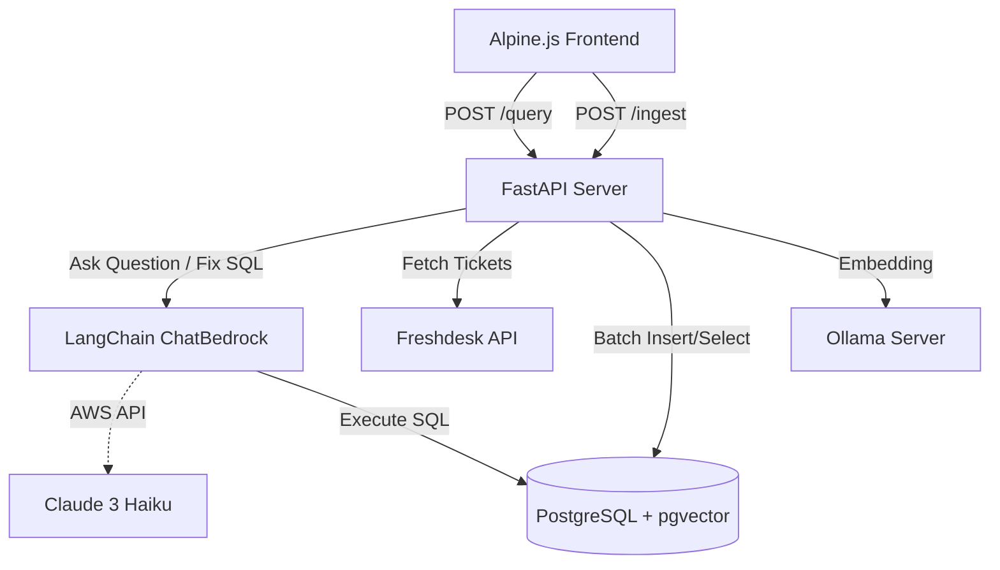

# Architecture Details: Ticket Intelligence RAG Application

## System Components

### 1. The PostgreSQL + Vector Engine
- Holds the raw `freshdesk_tickets` table.
- Stores `embedding` tags created from the combination of `subject` and `description` to enable dense vector similarity searches `(embedding <-> query)`.

### 2. The Backend Pipeline (FastAPI)
- **Ingestion Service**: Pulls tickets paginated from Freshdesk API, formats them according to our standard schema, embeds text via Ollama (`nomic-embed-text`), and stores arrays into the DB via `psycopg2`.
- **Query Agent Service**: Intercepts requests, uses Langchain's `ChatBedrock` wrapper hooked into Claude 3 Haiku to classify queries as analytical (`SQL_ANALYTICS`) or semantic (`SEMANTIC_SEARCH`). Generates raw Postgres SQL for analytical intents, runs safe queries, and leverages Claude to explain the results back to the frontend.

### 3. The Frontend Client (Alpine.js)
- Pure Client Side Rendering connecting loosely to `localhost:8000`.
- Tailored for high-speed delivery using Alpine JS for simple two-way data bindings and the Fetch API, decoupling the monolithic LLM overheads entirely from the static bundle.

