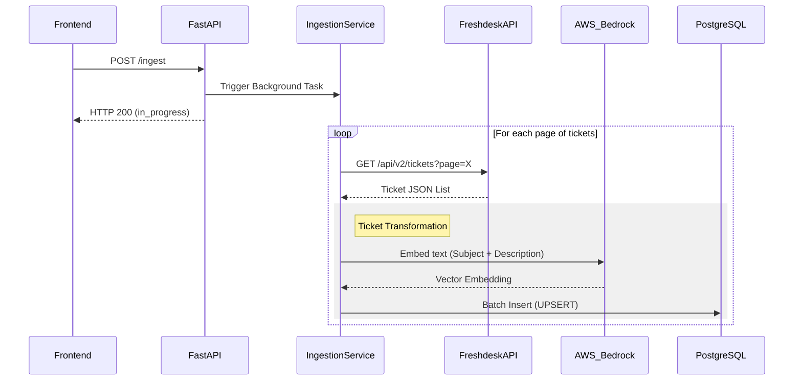
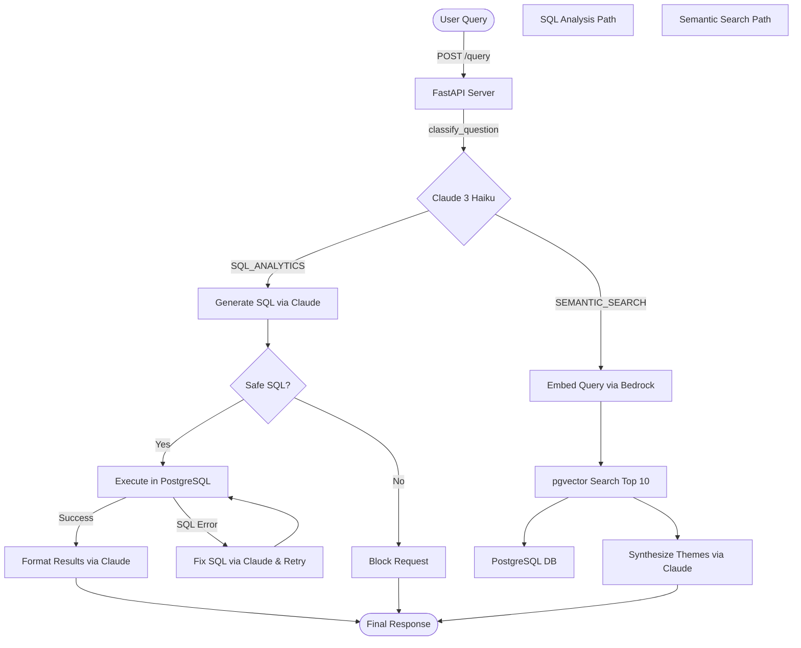

# System Process & Flow Documentation
This document outlines the end-to-end data pipeline and query processing flow of the Ticket Intelligence RAG Application based on the current codebase.

## 1. Data Ingestion Process (`backend/services/ingestion.py`)

The ingestion pipeline is designed as an asynchronous background task to sync tickets from Freshdesk into a local PostgreSQL database with vector embeddings.

**Process Steps:**
1. **Trigger**: An admin hits the `POST /ingest` endpoint on the FastAPI backend.
2. **Fetch Data**: The `IngestionService` paginates through the Freshdesk API (`/api/v2/tickets`), fetching 100 tickets per page. Retry mechanisms are in place for API rate limits (HTTP 429).
3. **Data Transformation**: Each raw ticket JSON is mapped to the internal `freshdesk_tickets` database schema. 
4. **Embedding Generation**: 
   - A descriptive text is constructed by concatenating the ticket's `subject` and `structured_description`.
   - This text is sent to **AWS Bedrock** using `BedrockEmbeddings` to generate high-dimensional vectors.
5. **Database Storage**: The transformed data and generated embeddings are batch-inserted or updated (`ON CONFLICT (id) DO UPDATE`) into the PostgreSQL database using `psycopg2`.

## 2. Query Agent Execution Flow (`backend/services/query_agent.py`)

The query agent receives natural language questions from the user and decides between executing a data analytical SQL query or performing a semantic vector search.

**Process Steps:**
1. **User Request**: The user submits a question via the frontend UI (`POST /query`).
2. **Classification**: `QueryAgentService` prompts **Claude 3 Haiku** to classify the query into either `SQL_ANALYTICS` or `SEMANTIC_SEARCH`.
3. **Execution Path: SQL Analytics**:
   - **SQL Generation**: Claude is prompted with the PostgreSQL table schema and business rules to generate a valid `SELECT` statement.
   - **Validation**: The backend extracts the SQL and checks for dangerous keywords (`DELETE`, `DROP`, `UPDATE`, etc.).
   - **Execution**: The query is executed against PostgreSQL.
   - **Auto-Fixing**: If execution fails, the error and bad SQL are sent back to Claude to modify and retry.
   - **Formatting**: The query results are passed back to Claude to be synthesized into a concise, human-readable bulleted list.
4. **Execution Path: Semantic Search**:
   - **Embedding**: The user's question is embedded using **AWS Bedrock**.
   - **Vector Search**: The system executes an nearest-neighbor similarity search using `pgvector` (`ORDER BY embedding <-> query_vector LIMIT 10`) on PostgreSQL.
   - **Synthesis**: The top 10 relevant tickets are sent to Claude to identify common themes and structure a Markdown summary answering the user's question.
5. **Response**: FastAPI returns the categorized answer, the raw data, and the executed SQL (if applicable) back to the frontend.

## 3. Frontend Integration (`frontend/app.js`)

The frontend is a lightweight SPA built with **Alpine.js**.

- It manages dual-state interaction: triggering background jobs (`/ingest`) and handling bidirectional query conversations (`/query`).
- Uses `marked.js` with custom renderers to inject Tailwind CSS classes into Markdown responses provided by the LangChain backend.
- Displays raw data formats and underlying SQL queries interactively through toggles (`showRaw`, `showSql`).